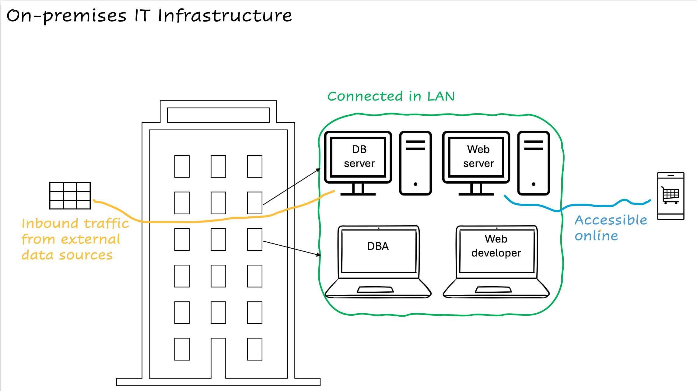
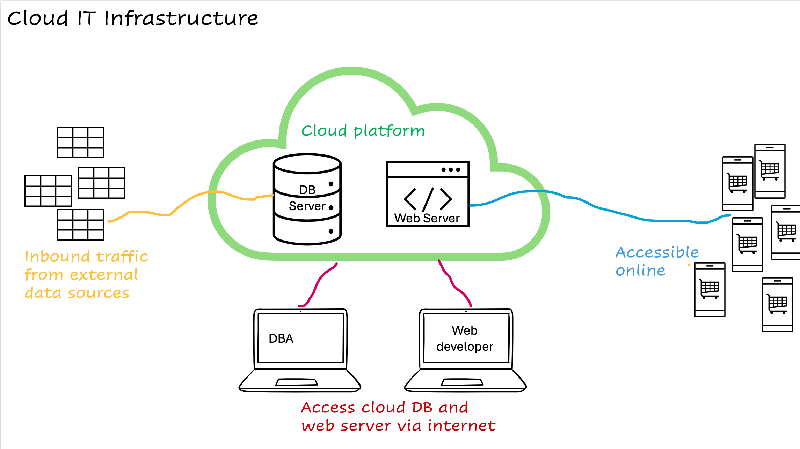

# Course Introduction

## On-premises vs cloud IT services
A company can hardly operate without various IT service components, which forms IT infrastructure of a company. Depending of the size of a company, the IT infrastructure can include various IT service components, and a data engineer can work with a smaller or larger part of the IT infrastructure. A data engineer should also understand basics of IT infrastructure as a datapipeline often involves integration of different components in a company's IT infrastructure.

Let's have a look at a simple example of a small e-commerce company. This company is selling clothes online and gather data such as warehouse stock levels, product prices and customer data etc from external data sources. 

The company is renting a physical office. In one floor, it places two desktop computers to host the database server and web server. This floor needs physical security measures to prevent unauthorized access, and also air-conditioning to avoid overheat of the servers. This company employs a database administrator to manage the DB server and a web developer to develop its website. They work with laptops. 

These laptops are connected to the two servers in a Local Area Network (LAN) so that these computers can communicate with each others. Apart from the LAN, additional networking setups are needed so that the DB server can receive inbound traffic from external data sources and consumers can access the website for online shopping. 

The computers (hardware), applications for DB and web development installed on the computers (software), and networking devices connecting themselves and to the outside world form a simple example of IT infrastructure of this type of business. 

## Why do we need cloud platform?
The on-premises IT infrastructure above requires an upfront cost to set up different computers and networking devices for the company to start operate. At the same time, the capacity of the two servers are relatively fixed and the company cannot react to varying inflow of data or customers browing its website. This results in downtimes as the company cannot scale up its IT infrastructure flexibly. These issues prompt companies to migrate to cloud IT infrastructure. 

>[!Note]
>Cloud IT infrastructure is the delivery of IT services OVER THE INTERNET so that a company does not need to maintain physical hardwares and premisese as before

For example, the company can alternatively set up a cloud IT infrastructure as below. Instead of purchasing two server computers and placing them in a physical office, it can use cloud DB and web servers and pay for the actual usage of the servers. The DBA and web developer can connect to these cloud servers via internet. The benefits are:
- **cost efficiency**  
  the company now does not need to pay for the upfront cost to purchase the server computers, and extra cost to arrange a secure physical office to accomodate them.
- **scalability and availability**  
  cloud providers maintain many server computers behind the scenes and are able to scale up their IT services flexibly. In this case, the capacity of the cloud and web servers can be adjusted according to realtime needs. Downtimes of the company's website can thus be prevented, without the company purchasing more capable computers that are left idle during off-peak hours when less customers are browsing the website. 

## Big data and cloud platform
Nowadays, companies are often managing and analyzing *big data* which can be characterized by 3 Vs:
- **Volume**  
  companies may be interested in customer feedbacks from social media or customer usage data from their products' sensors, which produces a sheer amount of data available to be processed for further use
- **Velocity**  
  these data can be generated frequently and companies may want to process them immediately for realtime analysis
- **Variety**  
  these data can be structure, semi-structured and unstructured- such as text, images, videos etc, which opens up the opportunity to reveal valuable insights from more various data

Working with big data further motivates companies to migrate to cloud infrastructure as the natures of cloud infrastructure fits the needs of big data. For instance, the volume and velocity of big data often varies during the day, which means that the scalability nature of cloud infrastructure can prevent a company from downtimes or over-provisioning expensive on-premises hardwares. On the otherhand, the wide range of services provided by different cloud platform providers also let companies to find suitable tools to analyze their different types of big data.

  
🧠 <b>Knowledge check</b>

  Can you explain these terms intuitively in an interview for cloud data engineer position?

  - On-premises IT infrastructure  
  - Availability, uptime and downtime of an application  
  - Scalability of IT infrastructure  
  - 3 Vs of big data  
  - Difference between cloud and big data

## Videos to review some concepts 
For slides used in these videos, you can find them attached under this lecture folder:

 

