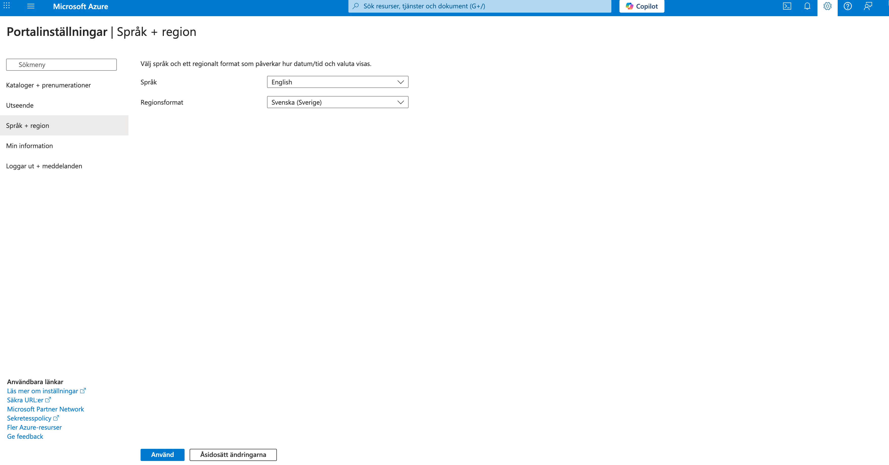
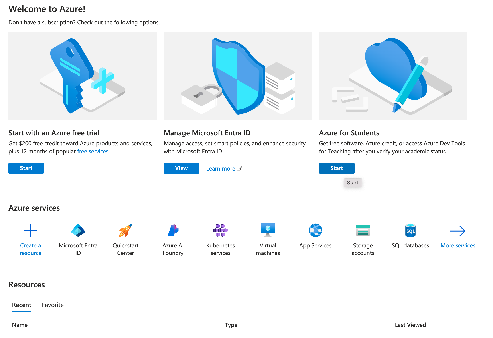
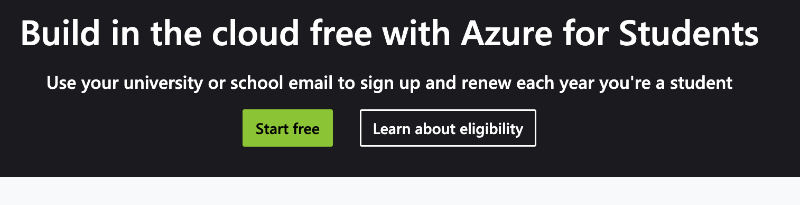
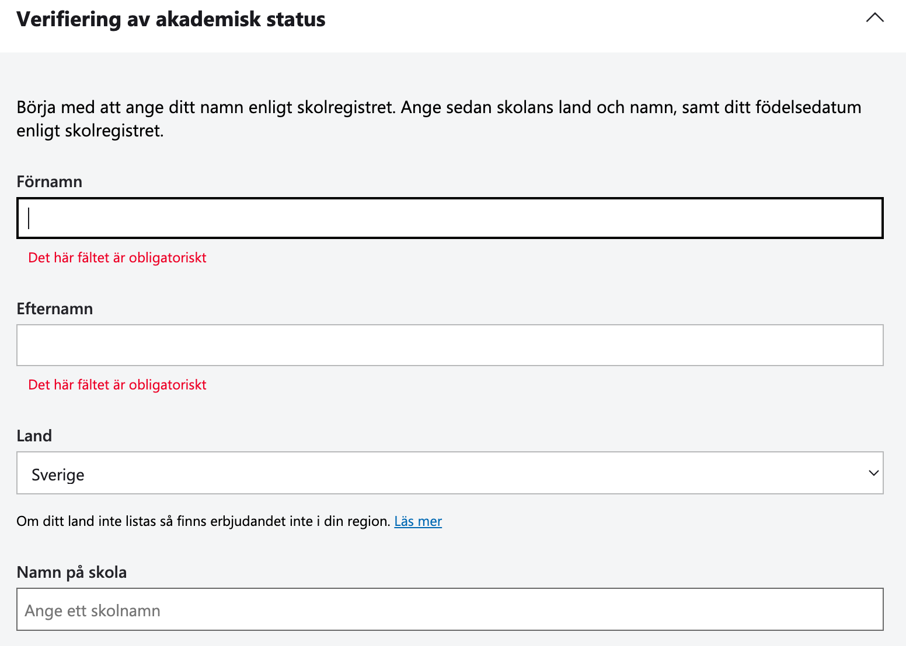
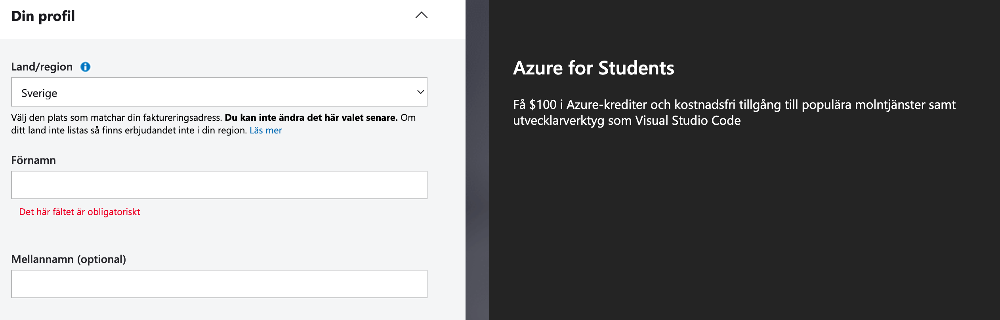
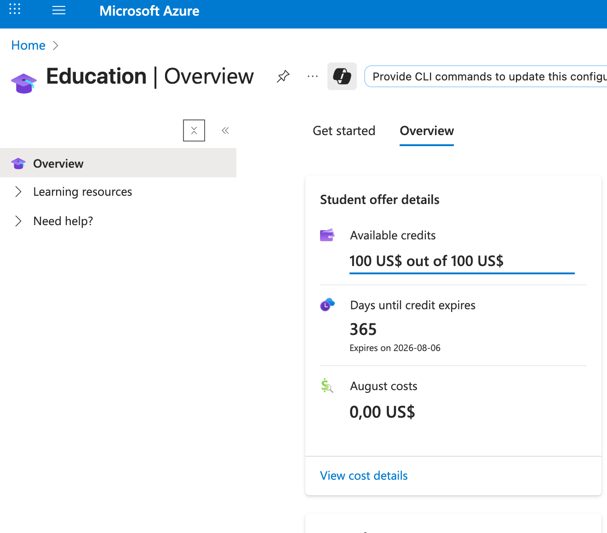

# Azure for Students - Free Account
In this course, we will be using Azure as the cloud platform for illustration purpose. Therefore, in this and the two following lectures, we will set up your Azure account, and introduce what is Azure and how to manage your IT services on Azure. 

You will use Azure for Students free account to complete exercises. To create an Azure for Students free account, your school needs to have an agreement with Microsoft and you need to use your school email account for registration. With this account, you will get credits from Microsoft to spend.

>[!Warning]
>The student credits are limited and you need them for other courses, therefore, always delete Azure resources after finishing exercises.

## Instructions
Follow the steps below to create your account:

First, log into [Azure Portal](https://www.portal.azure.com) with your school email account. Then, change the language to English.

Go back to the main page of Azure Portal and start Azure for Students.

Click on *Start free*.

Fill in your school information.

Fill in your personal information.

Now, it is done! You can navigate to the *Education* page on Azure Portal to check your available credits and their expiry date. 
