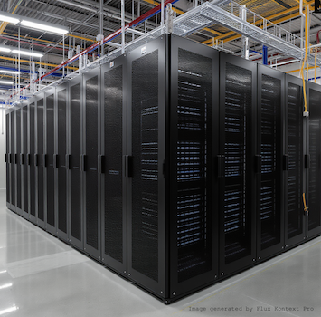

# Introduction to Azure Cloud Platform

## What does Azure provide? 
As a cloud platform provider with big market shares, Azure is providing a wide range of IT services via internet, including servers, storage and networking etc. Compared to on-premises IT infrastructure, companies now share some of the responsibilities to set up and maintain its IT infrastructure with cloud platform provider as Azure. How much of the responsibilities are shared depends on whether an IT service is offered as IaaS, PaaS or SaaS. This way of categorizing IT services is called shared responsibility model:

- **Infrastructure as Service (IaaS)**  
  If you create a virtual machine in Azure, you are using IaaS because you are responsible for everything apart from handling the physical hardware. For example, you need to choose the operation system, install and patch all softwares necessary for your work. 
- **Platform as a Service (PaaS)**  
  With PaaS, developers can skip caring about the servers behind and focus on developing applications on Azure's servers behind the scenes. Azure App Service is a PaaS example, where developers can deploy apps without managing the infrastructure. 
- **Software as a Service (SaaS)**  
  With SaaS, users can use Azure's softwares online. Azure AI services are examples of SaaS available on Azure. 

🔍 [Read more on Shared responsibility models](https://learn.microsoft.com/en-us/azure/security/fundamentals/shared-responsibility)

  
🧠 <b>Knowledge check</b>

  Suppose you have a MacBook and you want to spin up a Windows virtual machine to visit YouTube using the Chrome browser. What do you need to do?

- [ ] Find a secure physical room to store your Windows VM
- [ ] Create strong credentials for logging into your Window VM and keep the credentials securely
- [ ] Patch the Windows operating system regularly
- [ ] Install Google Chrome on the Windows VM
- [ ] Keep Chrome up to date (enable automatic updates)

 

>[!Tip]
>Follow exercise 0.1 to enhance your understanding of shared responsibility model

## How does Azure provide services? 
Whenever you create an Azure resource, you often have to choose a region for this resource. So what are region and related geographical terms in Azure? And why are they related to how Azure is working as a cloud platform?

### Datacenters
The physical infrastructure of Azure are housed in buildings called datacenters. These datacenters store physical computer servers together with networking, power and cooling facilities. These facilities are arranged in racks. These physical infrastructure are providing IT services to Azure customers over internet.

**Datacenter racks** ⤵

### Regions
A region is a geographical area that is composed of one or multiple datacenters that are close to each others. When creating an Azure resource, we often need to choose from which region we would like the resource to be created. Then Azure internally assigns workloads across datacenters in the region to ensure balanced workloads. 

🔍 [Checkout the map of all Azure regions (NOT datacenters!)](https://datacenters.microsoft.com/globe/explore?info=region_swedencentral)

### Availability zones
Some regions are further divided into availability zones. Each availability zone contains one or multiple datacenters. These availability zones are isolated with each others in the sense that when one goes down, another can continue working. This prevents downtime faced by customers.    

>[!Note]
>Choice of region for an Azure resource is affected by many factors such as:
>- latency- Azure servers respond to end-users closer to a region
>- your availability target- regions with availability zones gurantee uptime to end-users

## How can you provision an IT service on Azure?

### Resource groups and resources
All IT services you pay for in Azure are called **resources**: virtual machines, databases, networking setups are all separate resources. Azure requires you to create a **resource group** to group created resources. With a good structure of resource groups and resources, one can manage resources more efficiently as one can, for example, grant access for or delete all resources within a resource group altogether.

### Subscriptions
Before creating resource groups and resources, you need to first create a **subscription** under your **account**. You can create multiple subscriptions under your accounts. Then, you can start creating resource groups and resources under different subscriptions. 

Subscription serves as a unit of billing and administration. A good structure of subscription facilitates billing and other administration tasks. For instance, if a company is working with development and production environments, which means that there is an IT infrastructure supporting each environment, it can create DEV and PROD subscription to host resources used in each environment separately. There is no rule on how to organize your subscriptions. Some companies may want to create separate subscriptions for different departments instead, like sales, IT, logistics departments etc.

🔍 [More details on the hierarchy of account -> subscription -> resource group -> resource](https://learn.microsoft.com/en-us/training/modules/describe-core-architectural-components-of-azure/6-describe-azure-management-infrastructure?ns-enrollment-type=learningpath&ns-enrollment-id=learn.wwl.azure-fundamentals-describe-azure-architecture-services)

## Examples of Azure resources
One can build an IT infrastructure with different Azure resources, or combine them with IT services on-premises or provided by other cloud platforms. Below are some Azure resources serving different purposes in an IT infrastructure:

>[!Note]
>There are much more Azure resources serving other purposes, like networking. These will not be covered here. 

### Computing services
Here're some commonly used computing services in Azure. You will be creating VM, Azure Web App and Azure Container Instance in this and following lectures, for hands-on experience to deepen your knowledge of them. 
- Virtual machine (VM)   
  VM works similarly as a physical computer. You configure specifications like OS, CPU and RAM etc upon creating a VM resource. It can be used as a lift-and-shift cloud migration as a company does not need to change its existing IT infrastructure much if it only wants to move physical servers to virtual ones. 
- Azure Web App   
  After you have locally developed a web application, you can deploy it to Azure App Service. Azure App Service provides the underlying servers to host your production web application as an Azure Web App, which is reachable by end-users online.
- Azure Functions  
  It's cost efficient to deploy your codes to Azure Functions if you would only like to run your codes when certain events triggers. For example, if you receive an email etc. It avoids provisioning resources when there is no actual needs for them. 
- Azure Container Instances   
  Azure Container Instances are used to spin up containerized applications. This is suitable when you have containerized applications requiring different operation systems. 

🔍 [More on Azure compute services](https://learn.microsoft.com/en-us/training/modules/describe-azure-compute-networking-services/)

  
🧠 <b>Knowledge check</b>

  Can you explain these concepts intuitively during an interview for cloud data engineer?

  - What do we describe a containerized application as short-lived and stateless?
  - Can a containerized application persistently store data?

### Data stores
On Azure, one can store different types of data with different Azure resources.
- Azure Storage Account  
  Under an Azure Storage Account, one can create different types of storages including:

  - Azure Blob Storage  
    stores unstructured data such as text files, images and videos. Data stored in Azure Blob Storage are called blobs. The capacities of blobs can be extended to Azure Data Lake Storage which are optimized for big data analytics workloads  
  
    🔍 [Azure Data Lake Storage and Data Lakehouse Architecture](https://learn.microsoft.com/en-us/training/modules/introduction-to-azure-data-lake-storage/6-use-cases)

  - Azure File Share   
    can replace on-premises file servers to provide hierarchical file system. It can be mounted by physical servers as a shared drive and containerized applications for persistent storage. 

- Azure SQL Database, Azure SQL Managed Instance & SQL Server on Azure VMs  
  are three separate resources in the Azure SQL family. One can choose one of them to host relational data depending on the preferred shared responsibility models: Azure SQL Database and Azure SQL Managed Instance are PaaS and SQL Server on Azure VMs is IaaS  
  🔍 [Azure SQL family provides IaaS and PaaS versions of SQL Server](https://learn.microsoft.com/en-us/azure/azure-sql/azure-sql-iaas-vs-paas-what-is-overview?view=azuresql)  
  🔍 [Azure SQL family products for non-relational data](https://learn.microsoft.com/en-us/azure/azure-sql/multi-model-features?view=azuresql)
  
>[!Tip]
>Follow exercise 0.1 to enhance your understanding of Azure SQL family
  
- Azure Cosmos DB   <!--variety of big data-->
  is an Azure's offering of NoSQL database. NoSQL databases receive growing popularity due to the rise of big data that involves more variety of data types. These data cannot be handled by a relational database as rows in tables. Azure Cosmos DB offers multiple database APIs to handle different types of non-relational data, allowing modelling of real world data using documents, key-value, graph and comlumn family data models. SQL is not used for queries. These data have their own programming lanaguages for query purpose.  
  🔍 [Non-relational data models](https://learn.microsoft.com/en-us/azure/architecture/data-guide/big-data/non-relational-data)  
  🔍 [NoSQL database](https://azure.microsoft.com/en-us/resources/cloud-computing-dictionary/what-is-nosql-database)

### Analytics
- Azure Databricks   <!--velocity of big data-->
  is an *unified* data platform to combine distributed computing and storage optimal for big data analytics purposes. 

  
🧠 <b>Knowledge check</b>

  Let's create a Azure Storage Account - Blob Storage to 
  
  - practice creating subscription, resource group and resource
  - upload one file 
  - understand python connection

## Videos to review some concepts 
For slides used in these videos, you can find them attached under this lecture folder:

