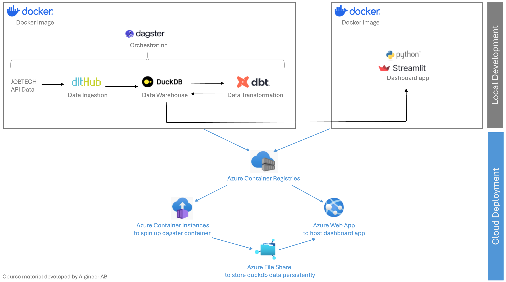
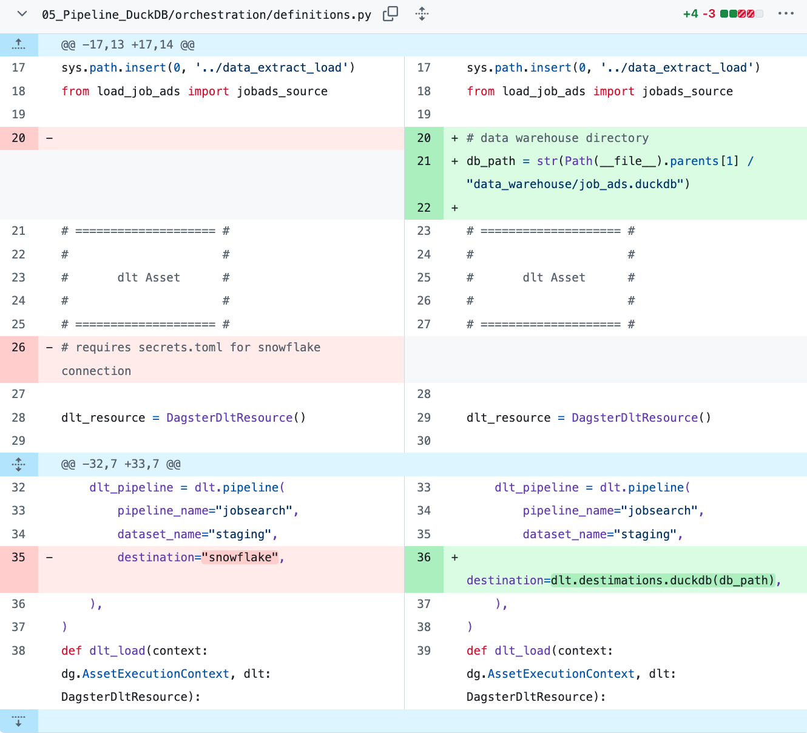
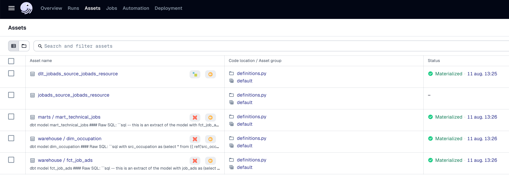

# Deploying data pipeline to Azure

## Introduction
From lectures 5 to 9, we will illustrate steps by steps how to deploy a data pipeline to Azure. We will start from a data pipeline developed locally in [another course](https://github.com/AIgineerAB/data_warehouse_course) which loads job ads data from an API with dlt to Snowflake, transform data with dbt and present the data with a Streamlit dashboard. The only difference is that we will replace Snowflake with DuckDB as the data warehouse here in this course. After going through this part of the course, you will get a hands-on experience to locally develop a data pipeline for a dashboard app, and then deploy it to Azure cloud platform. End-users can thus access the dashboard with updated data via internet.

Referring to the graph below, we will first start from explaining how the change from Snowflake to DuckDB will affect the locally developed scripts for the data pipeline, then moving to containerization with Docker, and eventually setting up different Azure resources for cloud deployment: 



## DuckDB
DuckDB is an open source Database Management System (DBMS). It persistently stores data in a single database file, i.e. my_database.duckdb. 

### Set up

Follow [this link to install duckdb](https://duckdb.org/docs/installation/?version=stable&environment=cli&platform=macos&download_method=package_manager) on your computer.

We will also later need the python client for connecting to duckdb through Python. Install it under your existing uv virtual environment:

```bash
uv pip install duckdb
```

### DuckDB CLI
Start using the CLI with this command on your shell:

```bash
duckdb
```

You see that it is a transient in-memory database that starts, which is a temporary database that exists in memory only and has not been persisted to disk.

To create a database, just add a path to a database name, either existing or one that you want to create. 

```bash
duckdb <path_to_database.duckdb>
```

For example, 
```bash
duckdb temp.duckdb
```

Create a jokes table in the created database
```sql 
CREATE TABLE jokes (
    id INTEGER PRIMARY KEY,
    joke_text VARCHAR,
    rating INTEGER
);
```

Then insert some values
```sql
INSERT INTO jokes (id, joke_text, rating) VALUES
(1, 'Why don’t scientists trust atoms? Because they make up everything!', 8),
(2, 'Why did the scarecrow win an award? Because he was outstanding in his field!', 7),
(3, 'I told my wife she was drawing her eyebrows too high. She looked surprised.', 9),
(4, 'Why don’t skeletons fight each other? They don’t have the guts.', 6);
```

Also control that the table jokes have been populated by 

```sql 
SELECT * FROM jokes;
```

You can terminate the DuckDB session with `ctrl` + `D`.

### DuckDB Local UI

You can view the database data with DuckDB local UI. You can open up the UI for a database file with the DuckDB CLI command:

```bash
duckdb -ui temp.duckdb
```

### Replacing Snowflake with DuckDB in the existing data pipeline
At the end of [another course](https://github.com/AIgineerAB/data_warehouse_course), in lecture 15, we have created scripts to locally orchestrate a data pipeline with dlt and dbt with dagster. We need to change the Snowflake parts to DuckDB instead. Also, the streamlit python scripts also need to connect to DuckDB instead to get data for presentation.

>[!Tip]
>A data engineer needs to understand your pipelines well to be able to replace some components of a data pipeline. Because different companies build their data pipelines with different tools and a company may want to experiment replacing a component in a data pipeline for many reasons, like to cut costs. 

Update the scripts from the previous course following these steps:

#### Step 1 - Begin with existing scripts
Copy the folders, *data_extract_load*, *data_transformation* and *orchestration* from lecture 15. 

Create a new folder called *dashboard* and put two files there: *connect_data_warehouse.py* and *dashboard.py*. They are modified to connect data from DuckDB database file, instead of from Snowflake. 

#### Step 2 - Update dlt destination
- Create a folder called *data_warehouse* to store the duckdb database file that dbt is going to produce
- DON'T need to create a *.dlt* subfolder under *orchestration* folder for connection credentials to Snowflake
- Update dlt destination in the dagster script as below:


#### Step 3 - Update dbt's connection to dwh
- Add the profile below in `.dbt/profiles.yml` under the home directory of the computer. In below, the `ouputs` key `path` entry refers to the path to the DuckDB database file relative to *dbt_project.yml*.
    ```yml
    dbt_duckdb: 
    target: dev 
    outputs: 
        dev: 
        type: duckdb
        path: ../data_warehouse/job_ads.duckdb 
    ```
- Update the profile name in `dbt_project.yml`under the folder *data_transformation*. 

#### Step 4 - Try running the dagster orchestration and check the resulting data

- Install necessary libraries to your uv virtual environment
    ```cmd
    uv pip install "dlt[duckdb]" dbt-core dbt-duckdb dagster dagster-webserver dagster-dlt dagster-dbt streamlit
    ```
- Install dbt dependency after navigating to your dbt project directory
    ```cmd
    dbt deps
    ````
- Run dagster and start automations, after navigating to the folder *orchestration* where the dagster script is located
    ```cmd
    dagster dev -f definitions.py
    ```
    Then, you should see that both dlt and dbt assets are materialized on dagster UI:
    

Now, you have replaced Snowflake with DuckDB as your data warehouse. You can also check the data in the DuckDB UI and the streamlit dashboard.

