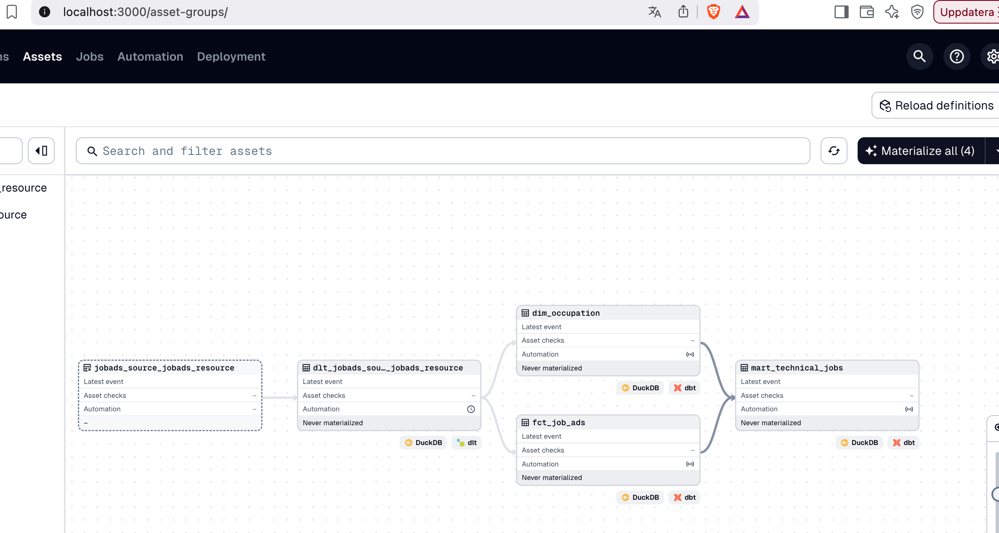
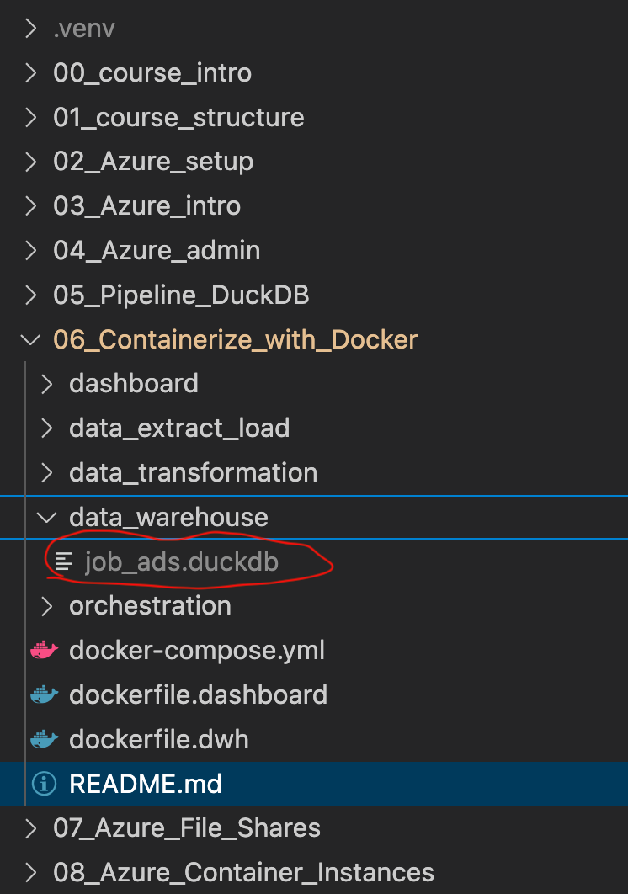
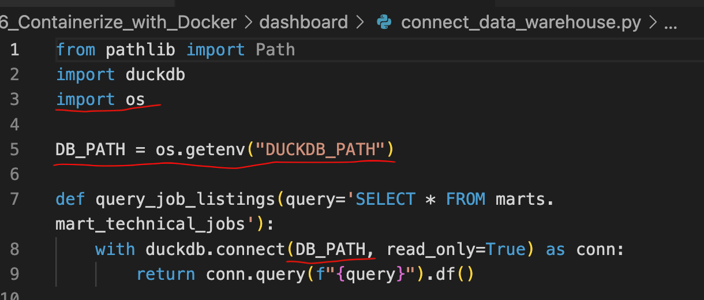
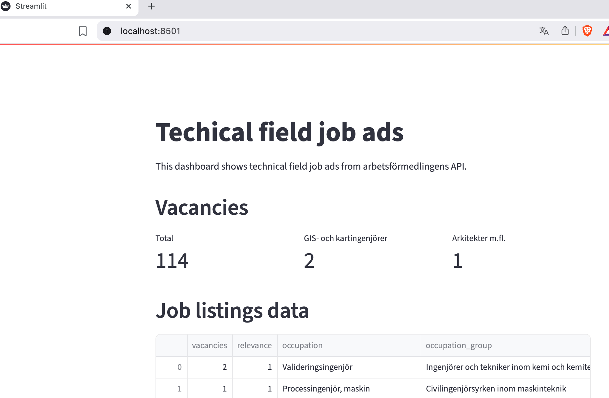

# Containerization with Docker: run dagster and streamlit in containers in the host machine

<a href="https://www.youtube.com/watch?v=eb95PyK1GJI" target="_blank">
  
</a>


In this lecture, we are going to use Docker to containerize the dlt-dbt-dagster and dashboard scripts separately. Becuase in the following lectures, they will be deployed to different Azure resources separately. For the fundamentals and setup of Docker, review lecture 4-6 in [another course](https://github.com/AIgineerAB/data_platform_course). The instructions below use the scripts we have developed in the last lecture. 

## Containerize data warehouse pipeline
Follow these steps to containerize the dlt-dbt-dagster scripts which form the pipeline to orchestrate the update of the data warehouse:

### Step 1 - Create dockerfile and docker-compose.yml
This dockerfile includes instructions of how the data warehouse pipeline image should be built, while the docker-compose.yml file describes how to run the container together with files and ports mapping with the host machine at runtime.  Check the files called *dockerfile.dwh* and *docker-compose.yml* under this lecture. Highlights of the files:

#### Bind mounts

>*“Data written to the container layer doesn't persist when the container is destroyed. This means that it can be difficult to get the data out of the container if another process needs it.”
> -From [Docker Docs on Storage](https://docs.docker.com/engine/storage/)*

In the extracts of the files below, you can see two bind mounts. These bind mounts mount the file, *profiles.yml*, and directory *data_warehouse* from your host machine (the physical one that runs Docker) into the container. The first one is read-only because the container does not need to modify the *profiles.yml* for dbt, while the second one is for persistent storage of the resulting DuckDB file after the container stops running.

```yml
#dwh_pipeline service in docker-compose.yml

volumes:
    #read-only bind mount
    - ${HOME}/.dbt/profiles.yml:/pipeline/profiles.yml:ro
    #blind mount
    - ./data_warehouse:/data_warehouse
```

#### Environment variables
Due to the bind mounts setting, the container will now use the *profiles.yml* file and data warehouse directory that are mounted to the container. As such, two environment variables are created to indicate these paths. The dlt, dbt and dagster scripts need to be updated accordingly (see step 2 below). 

```docker
#dockerfile.dwh

ENV DBT_PROFILES_DIR=/pipeline \
    DUCKDB_PATH=/data_warehouse/job_ads.duckdb
```

#### Port mapping
After the container is spinned up and runs, we would like to access the resulting dagster UI in our host machine. As such we need to map the port from the container to the host machine. 

First, when running the dagster command inside the container, we set the address and port as below. Otherwise, by default, dagster uses the localhost address, `127.0.0.1`, which is only accessible by the container, not the host machine.  

```docker
#dockerfile.dwh

CMD ["dagster", "dev", "-f", "definitions.py", "-h", "0.0.0.0", "-p", "3000"]
```

Then, you also need to publish the port to the host. Otherwise, the host machine cannot access dagster UI. 

```yml
#dwh_pipeline service in docker-compose.yml

ports:
    - "3000:3000"
```

So now, dagster accepts connection from other containers or the host machine, and listens on port 3000. We can then access dagster UI by using the host's browser as a client.

🔍 [View all dockerfile instructions](https://docs.docker.com/reference/dockerfile/)

### Step 2 - Update connections in dlt, dbt and dagster scripts
Following the set up of bind mounts and environment variables in the first step, we need to update the connection in the scripts:

#### Update dbt profile
Add this profile in *profiles.yml* located in your home directory and update the profile name in *dbt_project.yml*:
```yml
dbt_duckdb_docker_local: 
  target: dev 
  outputs: 
    dev: 
      type: duckdb
      path: "{{ env_var('DUCKDB_PATH') }}" 
```

#### Update dagster script:
In *definitions.py*, update the paths to dbt's *profiles.yml* and DuckDB path as below:

```python
DUCKDB_PATH = os.getenv("DUCKDB_PATH")
DBT_PROFILES_DIR = os.getenv("DBT_PROFILES_DIR")
```

```python
import os

dbt_project = DbtProject(project_dir=dbt_project_directory,
                         profiles_dir=Path(DBT_PROFILES_DIR))
```

### Step 3 - Spin up the container
Now you can run dagster inside the container: 

```cmd
docker compose build dwh_pipeline
docker compose up -d dwh_pipeline
```
You can then access the resulting dagster UI in the host machine by parsing `localhost:3000` on the browser, and materialize the dlt and dbt assets:


The DuckDB database file will be persistently stored in the host machine and is available even after the container stops:


## Containerize dashboard app
Similarly, we can containerize the dashboard app following these steps:

### Step 1 - Create dockerfile and docker-compose.yml

#### Bind mounts
The dashboard app only needs to read the DuckDB database file, so it is a read-only bind mount:

```yml
#dashboard service in docker-compose.yml

volumes:
    #read-only bind mount
    - ./data_warehouse:/data_warehouse:ro
```
#### Environment variables
The dashboard app needs an environment variable to store the path to the DuckDB database file:

```docker
#dockerfile.dashboard

ENV DUCKDB_PATH=/data_warehouse/job_ads.duckdb
```

#### Port mapping
When running the streamlit command inside the container, we set the address and port as below: 

```docker
#dockerfile.dashboard

CMD ["streamlit", "run", "dashboard.py", "--server.port=8501", "--server.address=0.0.0.0"]
```

And we will also publish the port to the host:

```yml
#dashboard service in docker-compose.yml

ports:
    - "8501:8501"
```

So now, streamlit accepts connection from other containers or the host machine, and listens on port 8501. We can then access the streamlit dashboard by using the host's browser as a client.

### Step 2 - Update connections in streamlit scripts

Update the connection in the script *connect_data_warehouse.py*:


### Step 3 - Spin up the container
Run the streamlit dashboard app in the container:

```cmd
docker compose build dashboard
docker compose up -d dashboard
```

You can access the resulting dashboard by parsing `localhost:8501` on the host's browser:


