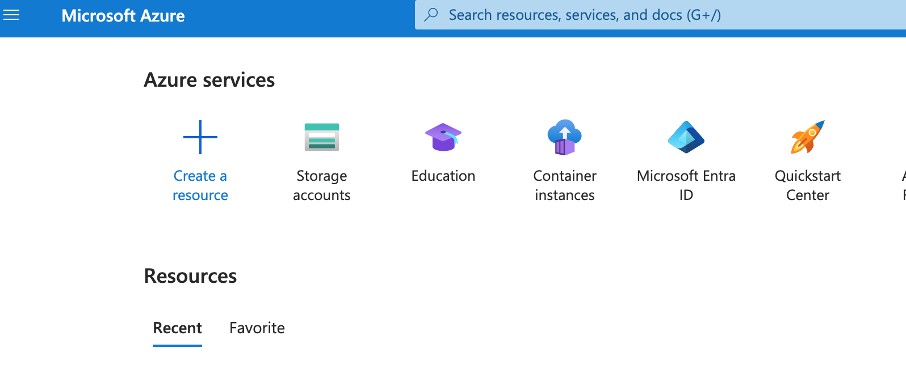
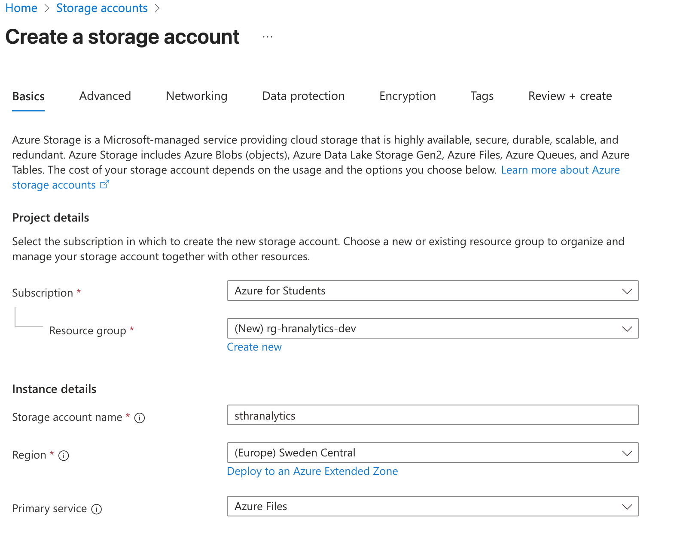
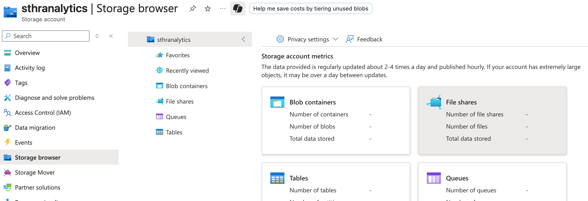
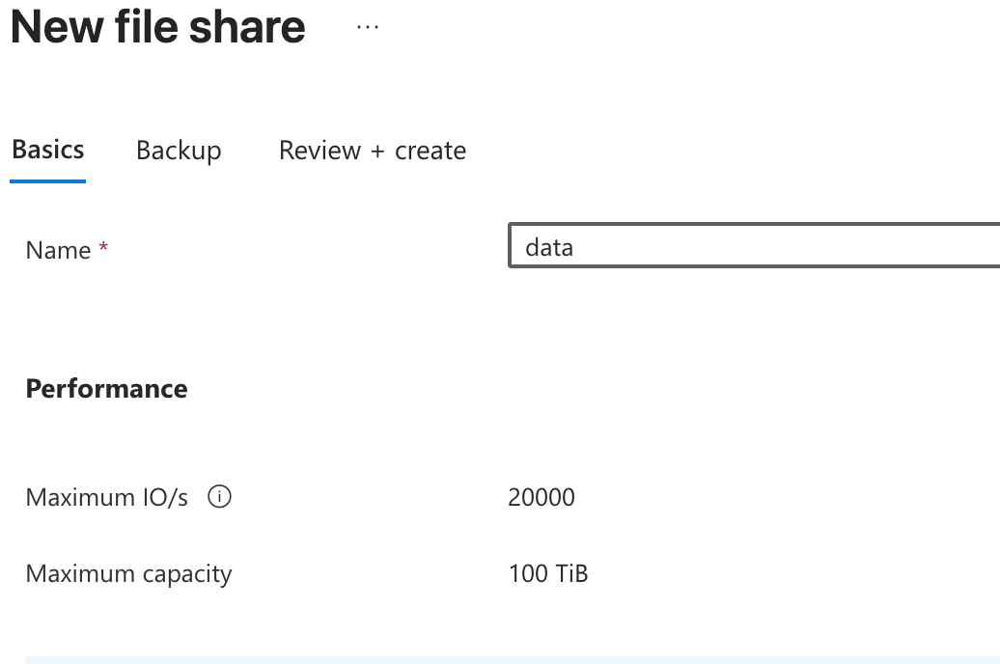
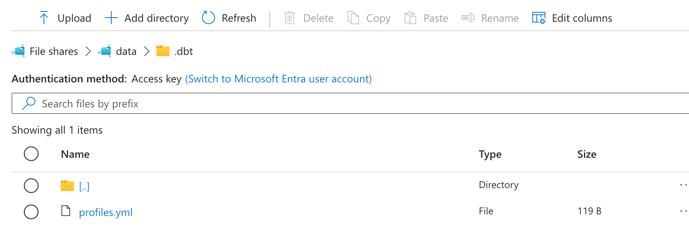
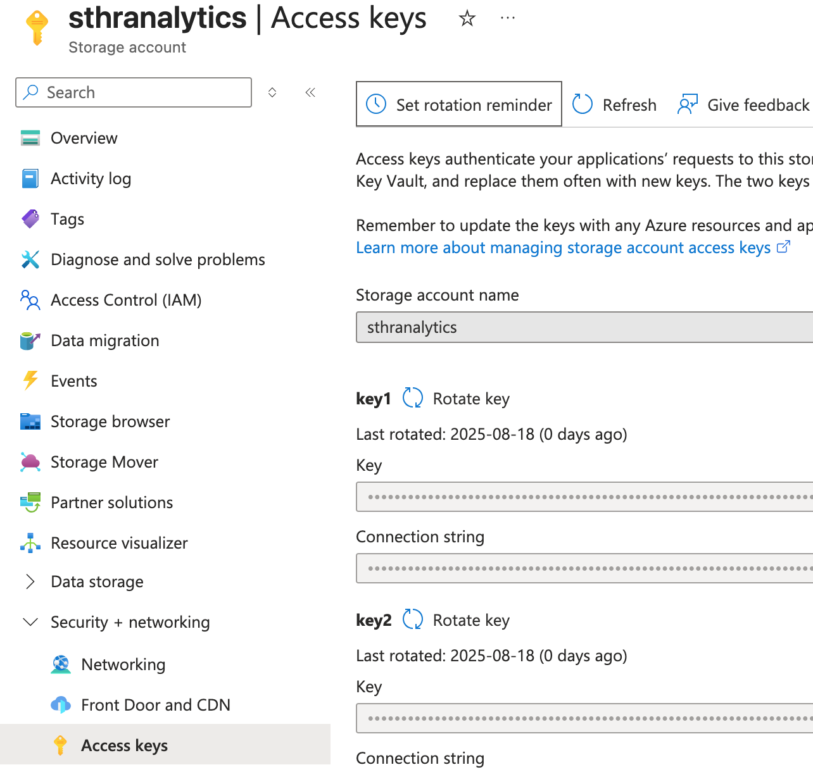

# Set up Azure File Share for persistent storage

In the last chapter, we use the local folder *data_warehouse* as our persistent storage for the DuckDB database file. Now that we are going to deploy our containerized applications to the cloud, we have to find a location in the cloud to replace our local folder. A simple solution is to use Azure File Share. We will follow Azure naming conventions when choosing names for Azure resources.

🔍 [ Check out more about Azure naming conventions](https://learn.microsoft.com/en-us/azure/cloud-adoption-framework/ready/azure-best-practices/resource-naming)

## Instructions
Follow the instructions below to set up Azure File Share:

### Step 1 - Create Storage Account
On Azure portal, click on *Storage accounts* under Azure services:

Fill in *Resource group*, *Storage account name*, and *Primary service*. Keep other default settings and create the resource:

### Step 2 - Add File Share
When the storage account has been deployed, navigate to the storage account. Find the Storage browser on the left panel and add a File Share:

You can choose the name of the new File Share, like *data*:

### Step 3 - Upload the dbt profiles.yml to File Share
Navigate to the File Share and add a directory called *.dbt*. In this directory, upload dbt *profiles.yml*:

### Step 4 - Find the connection credentials
Later, our containerized applications will need to access the File Share. This requires the storage account access keys that you can find here:

