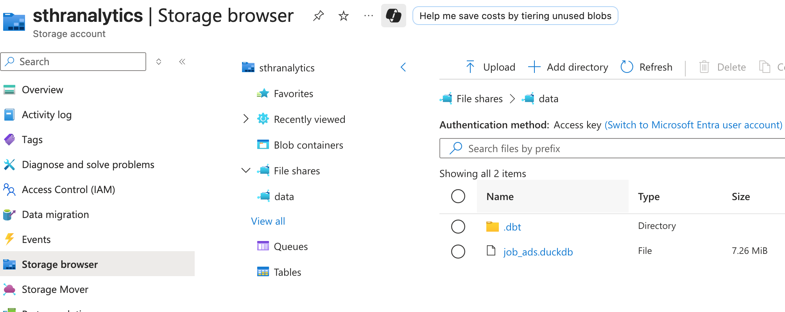

# Deploy Data Warehouse Pipeline


Note that the video is same for 07 and 08

<a href="https://youtu.be/6NkioZTYDlA" target="_blank">
  
</a>

We will now set up the deployment of dlt-dbt-dagster scripts. This deployment is used to produce an updated DuckDB database file in File Share, which will be consumed by the downstream streamlit dashboard application.

## Instructions
Follow the instructions below to set it up:

### Step 1 - Create Azure Container Registry (ACR)

Search for Container registries under Azure services:


Select the existing resource group and choose a register name. Keep other default settings:


When the ACR is deployed, activate admin user under Access Keys. This allows the use of username and password to connect to the ACR with Docker CLI in later steps:


### Step 2 - Update connection in local scripts
No changes are needed for the three folders: *data_extract_load*, *data_transformation* and *orchestration*. 

Remove the environment variables from *dockerfile.dwh*:
```docker
ENV DBT_PROFILES_DIR=/pipeline \
    DUCKDB_PATH=/data_warehouse/job_ads.duckdb
````

Remove the volumes from *docker-compose.yml*:
```docker
volumes:
    #read-only bind mount
    - ${HOME}/.dbt/profiles.yml:/pipeline/profiles.yml:ro
    #blind mount
    - ./data_warehouse:/data_warehouse
```

Add the image part in *docker-compose.yml*:
```docker
image: crhranalyticsdev.azurecr.io/hr-pipeline:latest
```

### Step 3 - Create image locally
Navigate to the directory containing the docker files in your local repo and build the image locally:

```cmd
docker-compose build dwh_pipeline
```

### Step 4 - Push image to ACR
Use Docker CLI to connect to ACR by:

```cmd
docker login crhranalyticsdev.azurecr.io
```

You will be prompted to enter the admin user's username and password of ACR:


When you successfully log into ACR. You can push the image to ACR:

```cmd
docker push crhranalyticsdev.azurecr.io/hr-pipeline:latest
```

Check that your image is now available under ACR on Azure Portal:


### Step 5 - Spin up Azure Container Instance (ACI)
<!--via azure portal, there is no choice to mount when creating ACI-->
Now we can use the image pushed to ACR to spin up an Azure Container Instance. We will use Azure CLI via Azure Cloud Shell for this. 

Open an Azure Cloud Shell session on Azure Portal:


Create an Azure Container Instance with the commands below. Insert necessary passwords:
```CMD
az container create \
  --os-type Linux \
  --resource-group rg-hranalytics-dev \
  --name dagstercontainer \
  --image crhranalyticsdev.azurecr.io/hr-pipeline:latest \
  --registry-login-server crhranalyticsdev.azurecr.io \
  --registry-username crhranalyticsdev \
  --registry-password [INSERT PASSWORD] \
  --ip-address Public \
  --ports 80 3000 \
  --environment-variables \
      DBT_PROFILES_DIR=/mnt/data/.dbt \
      DUCKDB_PATH=/mnt/data/job_ads.duckdb \
  --azure-file-volume-share-name data \
  --azure-file-volume-account-name sthranalytics \
  --azure-file-volume-account-key [INSERT PASSWORD] \
  --azure-file-volume-mount-path /mnt/data \
  --cpu 1 \
  --memory 4
  ```

  If you encounter the below error:

  
  
  Register the namespace first before creating ACI:
  ```cmd
  az account set --subscription "[INSERT SUBSCRIPTION ID]"
  az provider register -n Microsoft.ContainerInstance --wait
  az provider show -n Microsoft.ContainerInstance --query "registrationState" -o tsv
  ```

  When the ACI is successfully deployed, you can see that the container instance is automatically running. Stop or delete the instance if you don't need it to save credits:

  

  <!--add an exercise to use an ACI with lower memory-->

### Step 6 - Check Dagster UI through ACI
Use the public IP address of the ACI and the chosen port (i.e. 3000) to reach dagster UI from your physical machine:


After materializing the dlt and dbt assets, you can find the resulting DuckDB database file persistently saved to the File Share:


