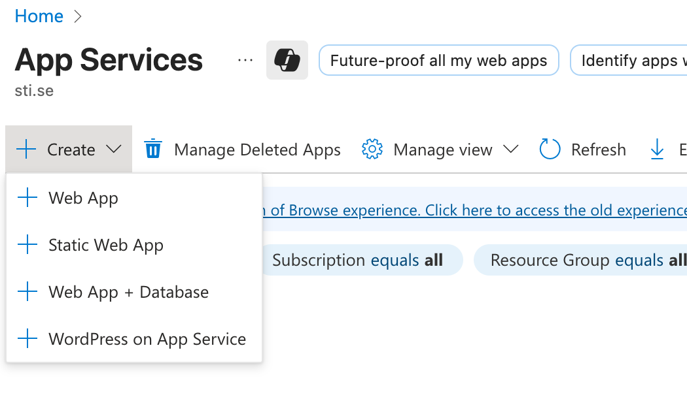
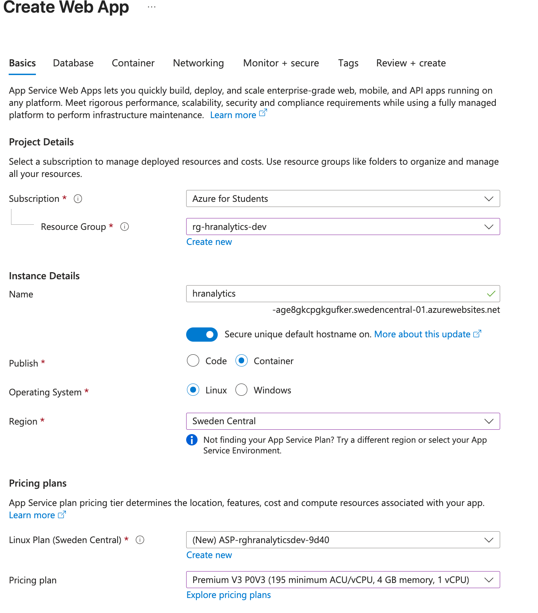
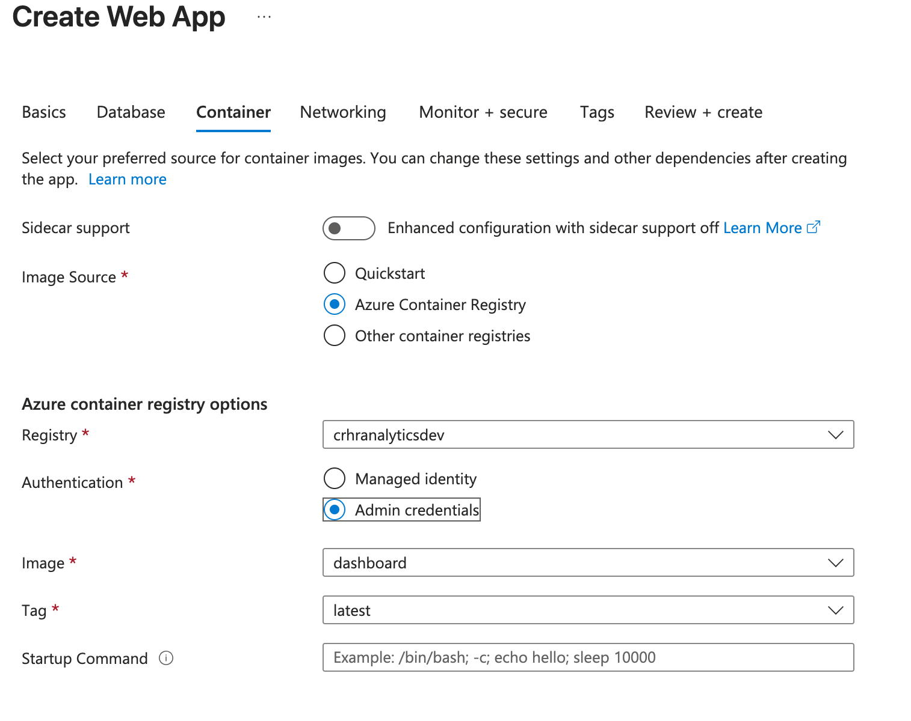
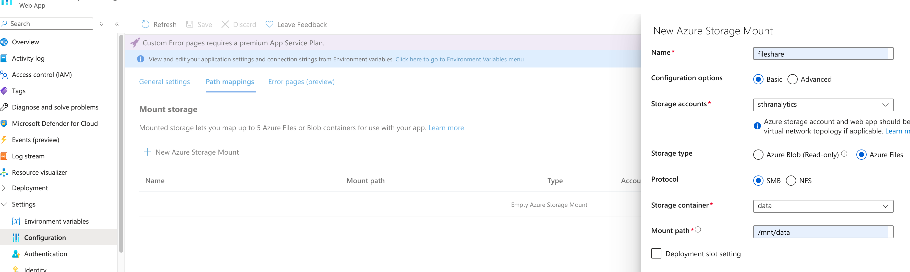
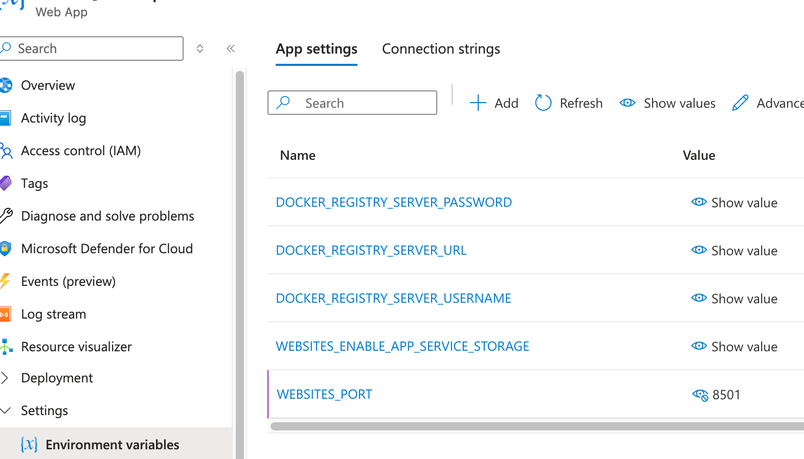
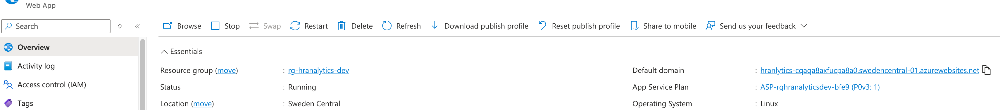

# Deploy Streamlit Dashboad App to Azure Web App

We will be using Azure App Services to host an Azure Web App for deploying our streamlit dashboard app.

## Instructions

### Step 1 - Update Connection in Local Scripts

Remove environment variable from *dockerfile.dashboard*:
```DOCKER
ENV DUCKDB_PATH=/data_warehouse/job_ads.duckdb
```

Remove volumes from *docker-compose.yml*:
```DOCKER
volumes:
  #read-only bind mount
  - ./data_warehouse:/data_warehouse:ro
```

Add image part on *docker-compose.yml*:
```docker
image: crhranalyticsdev.azurecr.io/dashboard:latest
```

Replace DB_PATH with FILE_SHARE_PATH in *connect_data_warehouse.py*:
```python
FILES_SHARE_PATH = Path("/mnt/data/job_ads.duckdb")
```

### Step 2 - Build and push image to ACR

```cmd
docker-compose build dashboard
docker push crhranalyticsdev.azurecr.io/dashboard:latest
```

### Step 3 - Create Azure Web App

Create a Web App under App Services:



Include the Web App in the existing resource group, provide an name, deploy with container and choose an appropriate pricing plan:



Provide the container image and unselect *sidecar support*: 



When the deployment is successful, add path mapping under configuration for mounting the File Share to the Web App container:




### Step 4 - Check Website Port

Check under environment variables if there is WEBSITES_PORT, add it if it does not exist:



Now, you will be able to check the deployed dashboard using the default domain:




## Another Example: Deploy Taipy Dashboard App to Azure Web App
<a href="https://www.youtube.com/watch?v=5vOYVLmj9tg" target="_blank">
  
</a>

<!--add ex: what is difference if deploy in ACI-->