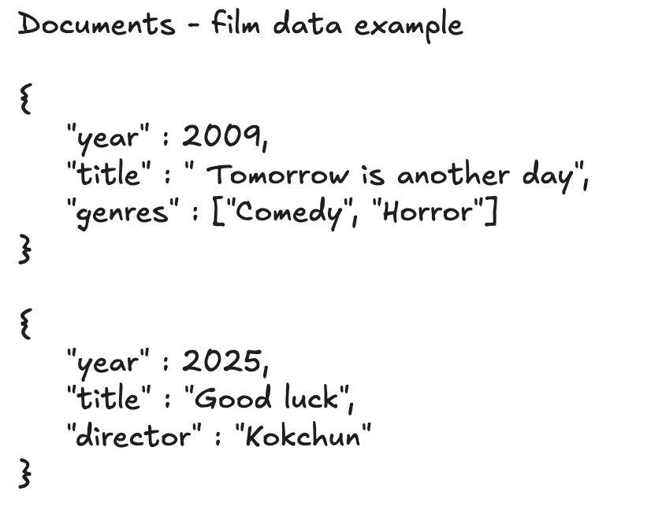
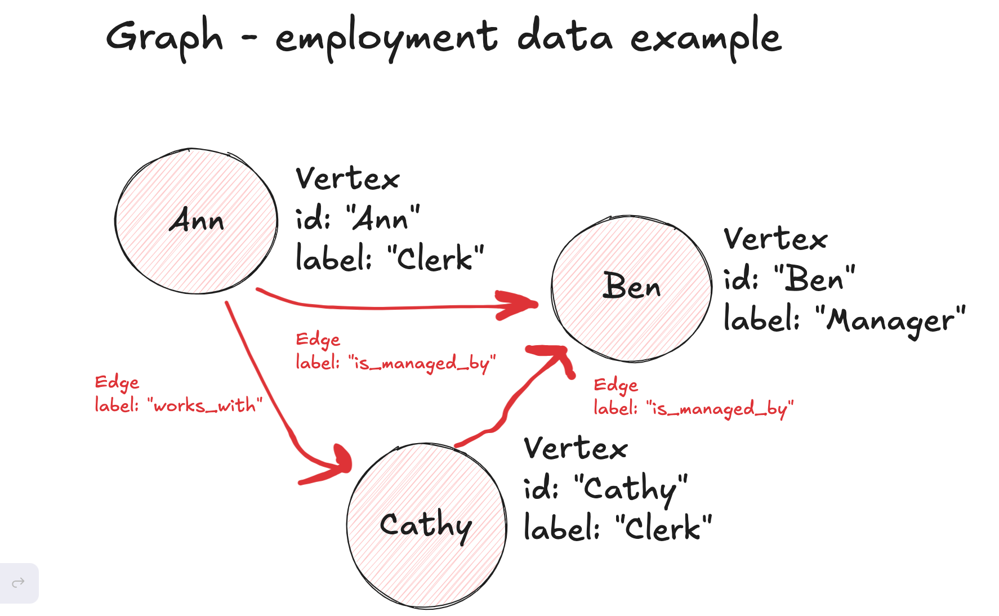
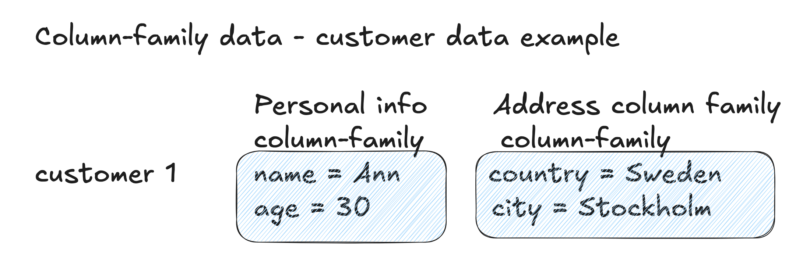
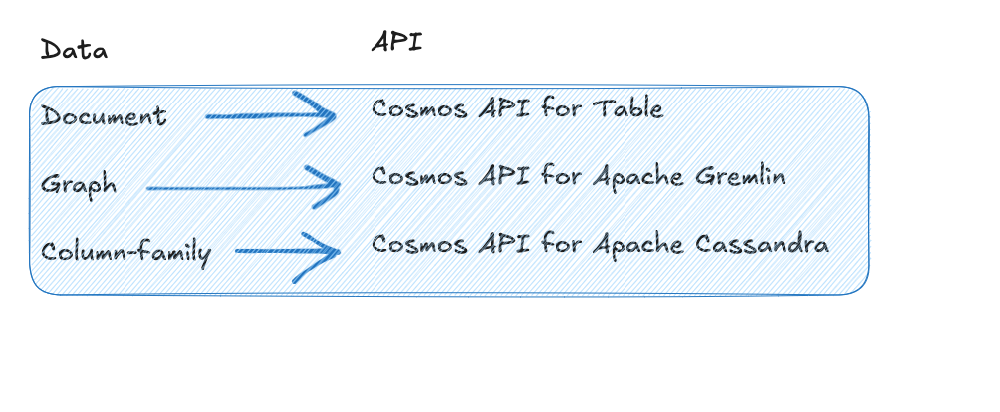

# Azure Cosmos DB - NoSQL Databases

## About this lecture
This lecture introduces the use of NoSQL databases. They can cater for the needs to process a wide variety (from 3Vs of big data) of data. We will focus on understanding 
- the data structures of three common non-relational data types
- how to manually create these data in Azure

## Non-relational Data
NoSQL databases are schema-less. The following are three common non-relational data types that are handled by different types of NoSQL databases.

##### Document
Data are stored as JSON documents. Different data entries can have different schemas. All contents in an entry can be queried. 

🔍 [Model document data in Cosmos DB](https://learn.microsoft.com/en-us/azure/cosmos-db/nosql/modeling-data)

##### Graph
A graph database stores data entities and relationship between them. Data are stored as vertices and edges. 

🔍 [Model graph data in Cosmos DB](https://learn.microsoft.com/en-us/azure/cosmos-db/gremlin/modeling)

##### Column-family
In column-family databases, for each row of record, a subset of column values are stored in one column family. This makes queries against a specific column fast and improve performance of analytics application.

🔍 [Model column-family data](https://learn.microsoft.com/en-us/azure/cosmos-db/cassandra/overview)

## Hands-on session

##### Set up
Under Cosmos DB, we can create instances of Cosmos DB with different APIs for processing different data types:

>[!Warning]
Similar to previous lectures, delete the related resources/resource groups once you have done with exercises. It's especially important for Cosmos DB due to its high cost.

## Other explorations
After the hands-on session, you can further explore:
- can you produce hypothetical data in the four types of non-relational data types we mentioned in this lecture that can fit into HR Analytics scenario that we have been working with in this and our previous courses?
- if you have found appropriate hypothetical data in the above exploration question, how would you like to adjust your data architecture (refer to our data architecture overview in lecture 05 in this repo)?